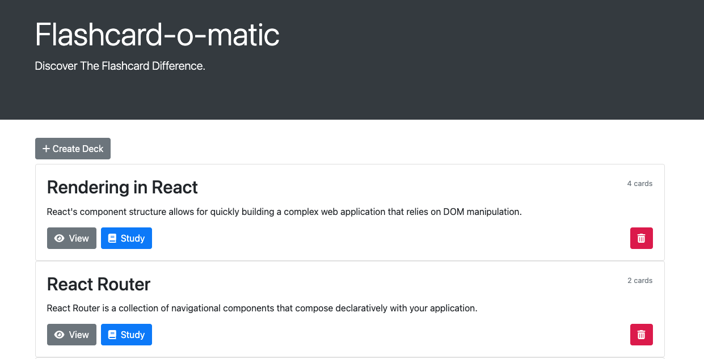

# Thinkful-Flashcard-App

Flash card application (Flashcard-o-matic) created to help students study online. Teachers will use this application to create decks of flash cards and students will study those decks. 

## Features

Permits the user to create flashcard decks to study. Users can edit cards on the fly, update deck names, and delete decks from the back-end.

## Tech Stack 

#### Front-end

HTML
Bootstrap
JavaScript
React

#### Back-end

REST API JSON Server 

## Screenshots

_/_

 